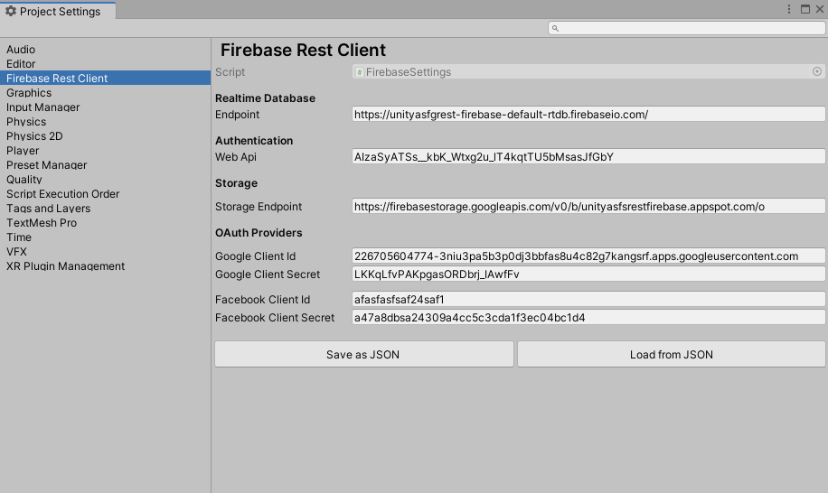

# Firebase Rest Client

Lightweight Firebase Library, made on top of REST API.

Implement Firebase to any Project without importing any Firebase SDK. This Library comes with all major features of Firebase SDK, including Realtime Database, Authentication and others are coming soon.

# Features

This library is so far supporting Realtime Database, Authentication from Firebase. Planning to add more support in future.

### Realtime Database

- Read
- RawRead (In Json Format)
- Write (Object, Key-Value, Raw Json)
- Update
- Remove
- Child Events (ValueChanged, ChildAdded, ChildRemoved, ChildChanged)
- Ordering (Key, Value, Child)
- Filtering (StartAt, EndAt, EqualTo, LimitTo)

### Authentication

- Email-Password Authentication
- Anonymous Authentication
- Email-Password Account Actions (Forget, Change Email/Password)
- OAuth Login
- Google OAuth Desktop Flow (Loopback)
- Auth Profile Actions (Display Name, Photo URL)

### Firebase Storage

- Upload File

```csharp
//reference
var firebaseStorage = new FirebaseStorage();

//Upload from direct filepath
string filePath = @"D:\Download\audacity-win-2.4.2.exe";

firebaseStorage.Upload(filePath, "File_From_File_Path_Array", progress =>
{
    Debug.Log(progress);
}).
OnSuccess(res =>
{
    //res = UploadResponse
    Debug.Log(res.downloadUrl);
}).
OnError(err => Debug.LogError(err.Message));

//Upload from byte array
byte[] data = File.ReadAllBytes(filePath);

firebaseStorage.Upload(data, "File_From_Byte_Array", progress =>
{
    Debug.Log(progress);
}).
OnSuccess(res =>
{
    //res = UploadResponse
    Debug.Log(res.downloadUrl);
});
```

More Features are being added on regular basis.

# Installation

Open Package Manager in Unity and Click on Plus Icon -> Add package from git URL, paste following link `https://github.com/SrejonKhan/FirebaseRestClient.git` and click Add.

Other methods (Asset Store, UPM, Release Page) will be added later after a stable release.

After importing to your project, \*\*Open Settings from (Edit -> Project Settings -> Firebase Rest Client) and set all required credentials.

<p align="center">
  
</p>

# Documentation

There will be a well written Documentation on a Stable Release and web-based Wiki in future.

# Known Limitations

This library is still under development. All limitations are being resolved one-by-one. Check [CHANGELOG](https://github.com/SrejonKhan/FirebaseRestClient/blob/main/CHANGELOG.md) for more details.
