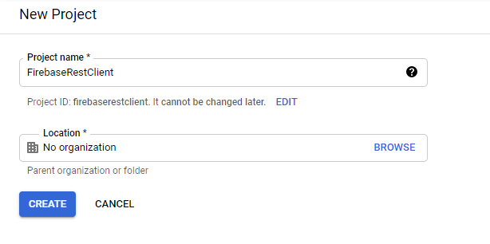
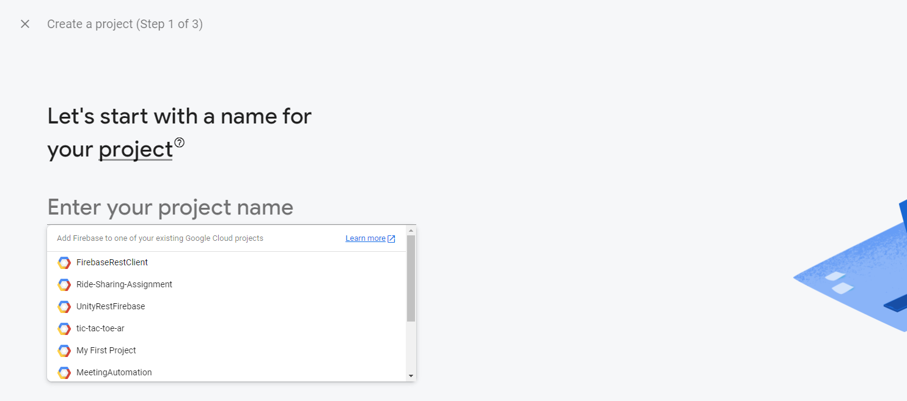
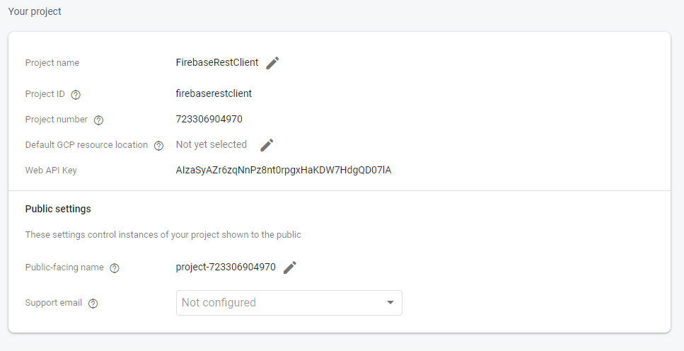
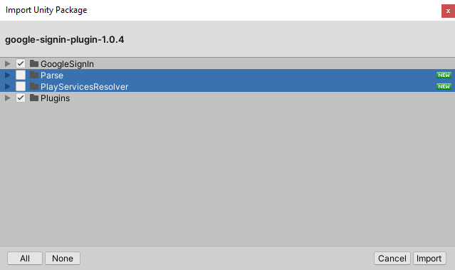
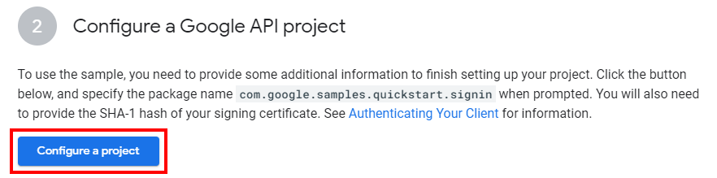
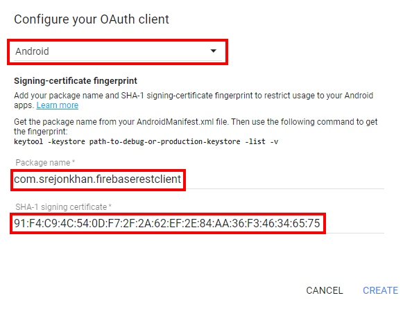
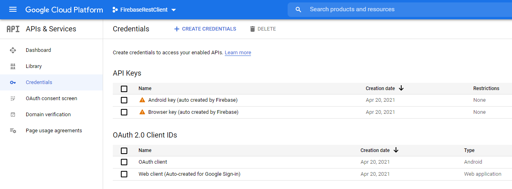
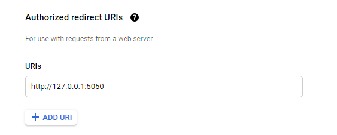
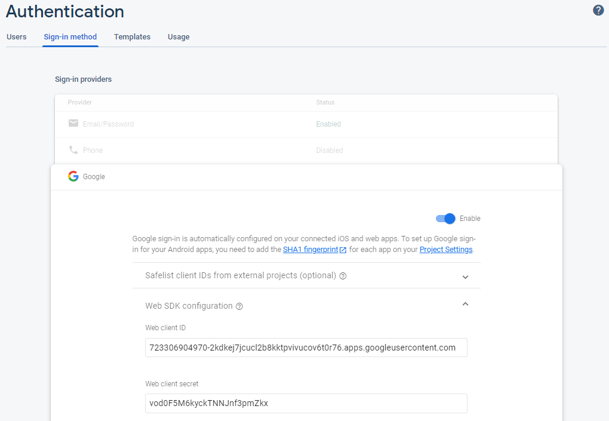

# Firebase Rest Client

Lightweight Firebase Library, made on top of REST API.

Implement Firebase to any Project without importing any Firebase SDK. This Library comes with all major features of Firebase SDK, including Realtime Database, Authentication, Storage and others are coming soon.

[Discord Server](https://discord.gg/vsXYmnRtC3)

# Installation

Open Package Manager in Unity and Click on Plus Icon -> Add package from git URL, paste following link `https://github.com/SrejonKhan/FirebaseRestClient.git` and click Add.

Other methods (Asset Store, UPM, Release Page) will be added later after a stable release.

# Configuring Project

After importing to your project, **Open Settings from (Edit -> Project Settings -> Firebase Rest Client).** This is where we will set all api configuration.

<p align="center">
  
</p>

### Setup Firebase Project (Recommended)

1. Go to Google Cloud Platform and [Create a Project](https://console.cloud.google.com/projectcreate)
   
2. Go to [Firebase Console](https://console.firebase.google.com/) and Create New Project. While creating project, **make sure to connect GCP Project** rather than creating new one.
   
3. After creating Firebase Project, enable your desired service(s) e.g Authentication / Realtime Database.
4. Remember, for **Web API Key**, you need to enable Authentication. Else, it will be empty.
   

This is recommended way to setup project if you're planning add authentication. If you're only planning to use Realtime Database with no authentication, try below procedures. Please keep in mind, if you connect your **Firebase Project with GCP Project**, there are somethings to remember. For instance, if you delete Firebase Project, it will delete your GCP project too.

### Setup Firebase Project (Shortcut)

1. Go to [Firebase Console](https://console.firebase.google.com/) and Create New Project. This time, no need to connect any GCP Project.
2. After creating Firebase Project, enable your desired service(s) e.g Authentication / Realtime Database.
3. Remember, for **Web API Key**, you need to enable Authentication. Else, it will be empty.

If you follow this procedure, and planning to add Google Sign-In SDK, you may face some problem with ClientId and Secret. It's better to follow recommended procedure to avoid any unwanted problem.

# Features

This library is so far supporting Realtime Database, Authentication and Storage from Firebase. Planning to add more support in future.

### Realtime Database

- Read
- RawRead (Json Format)
- Push
- Write
- Update
- Remove
- Child Events
  - OnValueChanged
  - OnChildAdded
  - OnChildRemoved
  - OnChildChanged
- Ordering
  - Order by Key
  - Order by Value
  - Order by Child value
- Filtering
  - StartAt
  - EndAt
  - EqualTo
  - LimitTo
- Locally generate Push ID

### Authentication (Experimental)

- Email-Password Authentication
  - Login and Registration
  - Forget Password Email
  - Email Verification Email
  - Change Email/Password
- Anonymous Authentication
- OAuth Login
  - Login with oauth token from any provider
- Google OAuth Desktop Flow (Loopback)
- User Profile Actions (Display Name, Photo URL)
  - Change/Add Display Name
  - Change/Add Photo URL
  - Get full profile

### Firebase Storage

- Upload File

More Features are being added on regular basis.

# Example

This is a general documentation. In future, there will be fully explained video and Knowledgebase. For any immediate support or discussion, join the [Discord Server](https://discord.gg/vsXYmnRtC3).

## Realtime Database

### Reference

```csharp
new RealtimeDatabase().ReadKeyValuePairs<User>();
new RealtimeDatabase().ReadKeyValuePairs();
new RealtimeDatabase().ReadValue();

new RealtimeDatabase().RawRead();
new RealtimeDatabase().RawRead(true);
new RealtimeDatabase().Read<User>();

new RealtimeDatabase().Push(user);
new RealtimeDatabase().Push(jsonString);

new RealtimeDatabase().WriteValue(user);
new RealtimeDatabase().WriteValue(jsonString);
new RealtimeDatabase().WriteKeyValuePair("key","value");
new RealtimeDatabase().WriteKeyValuePair("key","value", true);

new RealtimeDatabase().Update(user);
new RealtimeDatabase().Update(jsonString);

new RealtimeDatabase().ChildAdded(res => { });
new RealtimeDatabase().ChildRemoved(res => { });
new RealtimeDatabase().ChildChanged(res => { });
new RealtimeDatabase().ValueChanged(res => { });

new RealtimeDatabase().OrderByKey().OnSuccess(json => { });
new RealtimeDatabase().OrderByValue().OnSuccess(json => { });
new RealtimeDatabase().OrderByChild("id").OnSuccess(json => { });

new RealtimeDatabase().LimitToFirst(10).OrderByChild("id").OnSuccess(json => { });
new RealtimeDatabase().LimitToLast(5).OrderByChild("id").OnSuccess(json => { });
new RealtimeDatabase().StartAt(25).OrderByChild("id").OnSuccess(json => { });
new RealtimeDatabase().EndAt(125).OrderByChild("id").OnSuccess(json => { });
new RealtimeDatabase().EqualTo("srejon").OrderByChild("username").OnSuccess(json => { });

string pushId = new RealtimeDatabase().GeneratePushID();
```

### Initialize

```csharp
var firebase = new RealtimeDatabase();
```

### Read

```csharp
firebase.Child("users").ReadKeyValuePairs().OnSuccess(res =>
{
    //Returns response in Dictionary<string,string> (Dictionary<string,string>)
    //item.value.id is a property of user class
    foreach (var item in res)
        Debug.Log($"Key: {item.Key} - Value: {item.Value}\n");
}).
OnError(error =>
{
    Debug.LogError(error.Message);
});

firebase.Child("users").ReadKeyValuePairs<User>().OnSuccess(res =>
{
    //Returns response in Dictionary<string,User> (Dictionary<string,T>)
    //item.value.id is a property of user class
    foreach (var item in res)
        Debug.Log($"Key: {item.Key} - Value: {item.Value.id}\n");
});

firebase.Child("notices/51").ReadValue().OnSuccess(res =>
{
    //response can be in Json or simple string value
    //JSON will be returned if child value is an json object
    //simple string value will be returned if child value represents key-pair value
    Debug.Log(res);
});

firebase.Child("user/999").Read<User>().OnSuccess(res =>
{
    //response will be converted to desired type
    //Throws JsonUtilty error if couldn't be converted to desired type
    //best case to use when value is known as an object
    Debug.Log(res);
});

firebase.Child("product").Child("orange").RawRead().OnSuccess(res =>
{
    //Returns response in Json string
    Debug.Log(res);
});

//Shallow
firebase.Child("product").Child("orange").RawRead(true).OnSuccess(res =>
{
    //Returns response in Json string
    Debug.Log(res);
});
```

### Push

Push functionality in this library is a bit different from actual Firebase SDK. In this library, when Push() function called, it implicitly complete followings task -

1. Generate a Push ID locally
2. Write passed body to following path (childs + push id)
3. Returns generated Push ID as string

If you just want a Push ID, not directly writing, you can call `firebase.GeneratePushID()`, which returns push id in string format.

```csharp
var userObject = new User("DefaultName");
firebase.Child("users").Push(userObject).OnSuccess(uid =>
{
    //Returns Push ID in string
    Debug.Log(uid);
});

string jsonString = JsonUtility.ToJson(userObject);
firebase.Child("users").Push(jsonString).OnSuccess(uid =>
{
    //Returns Push ID in string
    Debug.Log(uid);
});
```

### Write

```csharp
// Write to specific node
// Object as payload, it can be any datatypes, even raw Json
firebase.Child("product").Child("orange").WriteValue(anyObject).OnSuccess( () =>
{
    Debug.Log("Successfully written.");
});

firebase.Child("product").Child("orange").WriteValue(123);
firebase.Child("product").Child("orange").WriteValue(324.25f);
firebase.Child("product").Child("stockout").WriteValue(true);


// Key and Value Pair, suitable for key-value pair leaderboard or similar.
firebase.Child("leaderboard").WriteKeyValuePair("player123", "123");
firebase.Child("leaderboard").WriteKeyValuePair("player321", "521", true); //append to parent
```

### Update

```csharp
// Object as payload
firebase.Child("users").Child("123").Update(user).OnSuccess( () => { /*...Codes...*/ });

// Json string as payload
firebase.Child("users").Child("123").Update(jsonString);

// Primitive datatype as payload
firebase.Child("users").Child("123").Update(5654.5f);
firebase.Child("users").Child("123").Update(123);
firebase.Child("users").Child("123").Update(false);
```

### Remove

```csharp
firebase.Child("product").Child("orange").Remove().OnSuccess( () => { /*...Codes...*/ });

firebase.Child("product").Child("orange").Remove();
```

### ChildEvents

There are 4 types of Events available in this library.

1. ChildAdded
2. ChildRemoved
3. ChildChanged
4. ValueChanged

#### ChildAdded

Listen for Child addition to targeted path and in-depth.

Recommended not to use in root level, as internally a snapshot creates and run query internally on each `put` response from server to differentiate among Update and Addition.

If it is required to listen in root level childs only, use `bool shallow = true` for listen to surface level child, not in-depth childs.

```csharp
firebase.Child("notices").ChildAdded(res =>
{
    //Firebase send full snapshot of child node, you can ignore by checking isInitial
    if (res.isInitial)
        Debug.Log(res.path + " | " + res.data);

    //This is real snapshot of event, you will get Json from res.data
    else
        Debug.Log(res.path + "\n" + res.data);
});

//Shallow Read
firebase.Child("users").ChildAdded(res =>
{ /*...Codes...*/ }, true); //true indicates shallow read, by default is false
```

#### ChildRemoved

Listen for Child Remove at any level from targeted path.

```csharp
firebase.Child("users").ChildRemoved(res =>
{
    //Firebase send full snapshot of child node, you can ignore by checking isInitial
    if (res.isInitial)
        Debug.Log(res.path + " | " + res.data);

    //This is real snapshot of event, you will get null from res.data
    else
        Debug.Log(res.path + "\n" + res.data);
});

//Shallow Read
firebase.Child("users").ChildRemoved(res =>
{ /*...Codes...*/ }, true); //true indicates shallow read, by default is false
```

#### ChildChanged

Combination of both ChildAdded and ChildRemoved.

<p align="center">
  
</p>

```csharp
firebase.Child("messages").ChildChanged(res =>
{
    //Firebase send full snapshot of child node, you can ignore by checking isInitial
    if (res.isInitial)
        Debug.Log(res.path + " | " + res.data);

    //This is real snapshot of event, you will get Json or null from res.data
    else
        Debug.Log(res.path + "\n" + res.data);
});

//Shallow Read
firebase.Child("users").ChildChanged(res =>
{ /*...Codes...*/ }, true); //true indicates shallow read, by default is false
```

Remember, as `ChildChanged` listen to both Add and Remove event, to make differentiate, check `if(res.data == "null")`. If server returns `null` in string format, that means a child was removed at specific path.

#### ValueChanged

Union of all server events.

```csharp
firebase.ValueChanged(res =>
{
    //Firebase send full snapshot of child node, you can ignore by checking isInitial
    if (res.isInitial)
        Debug.Log(res.path + " | " + res.data);

    //This is real snapshot of event, you will get Json or null from res.data
    else
        Debug.Log(res.path + "\n" + res.data);
});

//Shallow Read
firebase.Child("users").ValueChanged(res =>
{ /*...Codes...*/ }, true); //true indicates shallow read, by default is false
```

### Order

Order functions return a Json String. **Remember, returned JSON isn't in order, as JSON interpreters don't enforce any ordering.** Same applies to any filtered result.

If you want to order, you have to order itself in application. I'm planning to write a helper function to order json in future updates.

Remember, before using order function, make sure to [**Index your Database Rules**](https://firebase.google.com/docs/database/security/indexing-data). You can use `OnError` callback before setting up a index rules. `OnError` will throw error and tell exactly what is needed to add in index rules.

```csharp
firebase.Child("users").OrderByKey().OnSuccess(json =>
{
    //returns json string
});

firebase.Child("leaderboard").OrderByValue().OnSuccess(json =>
{
    //returns json string
});

firebase.Child("users").OrderByChild("id").OnSuccess(json =>
{
    //returns json string
});
```

### Order with Filters

Things to remember while filtering -

1. Filter functions come before Order function. E.g `StartAt("5").OrderByKey()`
2. Returned JSON isn't in order, as JSON interpreters don't enforce any ordering.
3. Filter functions params are in string, if you pass `5` as string, it will count
   it as number. If you want to filter by string, pass string inside quoutes.
   E.g `EqualTo(""\Orange"\")`

If you want to order, you have to order itself in application. I'm planning to write a helper function to order json in future updates.

```csharp
//StartAt
firebase.Child("users").StartAt("5").OrderByKey().OnSuccess(json =>
{
    //returns json string
});

//EndAt
firebase.Child("users").EndAt("125").OrderByKey().OnSuccess(json =>
{
    //returns json string
});

//LimitToFirst
firebase.Child("users").LimitToFirst("25").OrderByChild("id").OnSuccess(json =>
{
    //returns json string
});


//LimitToLast
firebase.Child("users").LimitToLast("25").OrderByChild("id").OnSuccess(json =>
{
    //returns json string
});

//EqualTo
firebase.Child("users").EqualTo("\"John Doe\"").OrderByChild("name").OnSuccess(json =>
{
    //returns json string
});
```

### Generate Push ID Locally

```csharp
string pushId = firebase.GeneratePushID();
```

## Authentication

### Initialize

```csharp
FirebaseAuthentication firebaseAuth = new FirebaseAuthentication();
```

### Account Actions

```csharp
firebaseAuth.CreateUserWithEmailAndPassword(email, password); //Password Signup

firebaseAuth.SignInWithEmailAndPassword(email, password); //Password Signin

firebaseAuth.SignInAnonymously(); //Anonymous SignIn

firebaseAuth.SignInWithOAuth("ACCESS_TOKEN_FROM_PROVIDER", "YOUR_PROVIDER_ID"); //OAuth SignIn

firebaseAuth.GoogleSignIn("AUTH_CODE_FROM_GOOGLE_TO_EXCHANGE_ACCESS_TOKEN"); //Google SignIn
firebaseAuth.FacebookSignIn("AUTH_CODE_FROM_FACEBOOK_TO_EXCHANGE_ACCESS_TOKEN"); //Facebook SignIn

firebaseAuth.SendPasswordResetEmail(email); //Password Reset Mail
firebaseAuth.SendEmailVerification(); //Email Verification (user must be signed in)

firebaseAuth.RefreshIdToken(refreshToken);
firebaseAuth.GetUserFromIdToken(idToken);
```

### User Actions

```csharp
FirebaseUser user = firebaseAuth.CurrentUser; //Current User automatically updates after any sign-in actions

user.ChangeEmail(newEmail); //Change Email
user.ChangePassword(newPassword); //Change Password

user.UpdateProfile("NEW_DISPLAY_NAME", "PHOTO_URL"); //Update Profile

user.Reload(); //Refresh User
user.RefreshAccessToken(); //Force to refresh token
user.Delete(); //Delete user

//User props
string displayName = user.DisplayName;
string userEmail = user.Email;
bool isEmailVerified = user.IsEmailVerified;
bool isAnonymous = user.IsAnonymous;
string photoUrl = user.PhotoUrl;
string provider = user.Provider;

firebaseAuth.SignOut(); //Sign out any signed-in user
```

### Auth State Change Listening

```csharp
firebaseAuth.StateChanged += AuthStateChanged;

// Track state changes of the auth object.
void AuthStateChanged(object sender, System.EventArgs eventArgs)
{
    if (firebaseAuth.CurrentUser != user)
    {
        bool signedIn = user != firebaseAuth.CurrentUser && firebaseAuth.CurrentUser != null;
        if (!signedIn && user != null)
        {
            Debug.Log("Signed out " + user.LocalId);
        }
        user = firebaseAuth.CurrentUser;
        if (signedIn)
        {
            Debug.Log("Signed in " + user.LocalId);
        }
    }
}
```

### Reauthenticate with Refresh Token
We can reauthenticate user with Refresh Token. IdToken generally expires in one hour, where Refresh Token in Firebase usually long lived unless any major action taken to account (Password Change, Email change etc.). 

Reauthentication should be done from the library, but as there is not any proper implementation for persistency, Library won't take liability of Reauthentication. Anyway, library provides some methods to reauthenticate from User side. 
```csharp
// Step 1 - Get new IdToken using Refresh Token 
string refreshToken = /*Get refresh token*/;
firebaseAuth.RefreshIdToken(refreshToken).
OnSuccess(res => 
{ 
    // Step 2 - Get User using IdToken
    firebaseAuth.GetUserFromIdToken(res.accessToken).
    OnSucess(user => 
    {
        // user authenticated
        // do your work
    }); 
});
``` 

## Storage

### Initialize

```csharp
var firebaseStorage = new FirebaseStorage();
```

### Upload from Direct Filepath

```csharp
string filePath = @"D:\Download\audacity-win-2.4.2.exe";

firebaseStorage.Upload(filePath, "File_From_File_Path_Array", progress =>
{
    Debug.Log(progress);
}).
OnSuccess(res =>
{
    //res = UploadResponse
    Debug.Log(res.downloadUrl);
}).
OnError(err => Debug.LogError(err.Message));
```

### Upload from Byte Array

```csharp
byte[] data = File.ReadAllBytes(filePath);

firebaseStorage.Upload(data, "File_From_Byte_Array", progress =>
{
    Debug.Log(progress);
}).
OnSuccess(res =>
{
    //res = UploadResponse
    Debug.Log(res.downloadUrl);
});
```

### Progress

Progress are between 0~1. Progress action can be passed as null argument, or simply without passing any.

```csharp
firebaseStorage.Upload(filePath, "File_From_File_Path_Array", null);
firebaseStorage.Upload(filePath, "File_From_File_Path_Array");
```

# Implementing Auth SDK

## Google Sign-In SDK (Android/IOS)

1. Download [Google SignIn SDK](https://github.com/googlesamples/google-signin-unity/releases/tag/v1.0.4) and [Unity Jar Resolver](https://github.com/googlesamples/unity-jar-resolver/releases). When importing SignIn SDK, make sure to exclude **Parse** & **PlayServicesResolver** folder. After importing SignIn Sdk, Import `external-dependency-manager-latest.unitypackage` from Unity Jar Resolver.
   

2. Go to [Configure Project](https://developers.google.com/identity/sign-in/android/start#configure-a-google-api-project) and configure your desired project.
   

3. Make sure Android is selected and exact Package Name and SHA-1 cert provided same as your project Package Name. For creating Keystore, use Unity's default [Keystore Manager](https://docs.unity3d.com/Manual/android-keystore-manager.html) and for generating SHA-1 Certificate, use [Keystore Explorer](https://keystore-explorer.org/) or command.  
   

4. Go to [Credential Tab](https://console.cloud.google.com/apis/credentials) in GCP and click on **Web client (Auto-created for Google Sign-in)** in OAuth 2.0 Client IDs Section. 

5. Add **http://127.0.0.1:5050** in Authorized Redirect URIs.
   

6. Copy **Client ID** and **Client Secret**, paste them in **Firebase Configuration (Edit -> Project Settings -> Firebase Rest Client).** 

7. Enable Google SignIn Method in Firebase Authentication. And copy **Client ID** and **Client Secret** from GCP (Step 4) and Paste them in **Web SDK Configuration**. 

8. Invoke this code when necessery.

   ```csharp
   GoogleSignIn.Configuration = new GoogleSignInConfiguration
   {
       RequestIdToken = true,
       // Copy this ClientID from GCP OAuth Client IDs(Step 4).
       WebClientId = "723306904970-2kdkej7jcucl2b8kktpvivucov6t0r76.apps.googleusercontent.com",
       RequestAuthCode = true,
       AdditionalScopes = new List<string>() { "https://www.googleapis.com/auth/userinfo.email" } //Scope for Email
   };

   //Google Sign-In SDK
   Task<GoogleSignInUser> signIn = GoogleSignIn.DefaultInstance.SignIn();

   signIn.ContinueWith(task =>
   {
       if (task.IsCanceled)
       {
           Debug.LogError("Cancelled");
       }
       else if (task.IsFaulted)
       {
           Debug.LogError(task.Exception.Message);

           using (IEnumerator<System.Exception> enumerator =
               task.Exception.InnerExceptions.GetEnumerator())
           {
               if (enumerator.MoveNext())
               {
                   GoogleSignIn.SignInException error =
                           (GoogleSignIn.SignInException)enumerator.Current;
                   Debug.LogError("Got Error: " + error.Status + " " + error.Message);
               }
               else
               {
                   Debug.LogError("Got Unexpected Exception?!?" + task.Exception);
               }
           }
       }

       //No Error
       else
       {
           string authCode = task.Result.AuthCode; //Auth Code

           //Signing-in to Firebase Auth
           firebaseAuth.GoogleSignIn(authCode).OnSuccess(user =>
           {
               string resulText = $"\n " +
               $"Email: {user.Email}, \n " +
               $"Local ID : {user.LocalId}, \n " +
               $"Provider : {user.Provider}, \n " +
               $"Is Anon : {user.IsAnonymous}, \n " +
               $"Display Name : {user.DisplayName}";

               Debug.Log(resulText);
           }).
           OnError(error =>
           {
               Debug.Log(error.Message);
           });
       }
   });
   ```

9. DONE!

## Google Sign-In (Standalone)

1. Skip if you have already configured GCP Project. If you're planning to implement Google Sign-In **both for Android/IOS and Standalone**, follow previous segment to configure project. If you're only planning for Desktop Sign-In, follow all steps below-
   - Go to [Credential Tab](https://console.cloud.google.com/apis/credentials) in GCP and click on **Create Credentials -> OAuth Client ID**
   - Select **Web Application** as Application Type.
   - Give meaningful name
   - Add `http://127.0.0.1:5050` to Authorized redirect URIs.
   - Click Create
2. Go back to [Credential Tab](https://console.cloud.google.com/apis/credentials) in GCP and click on previously created Client ID in OAuth 2.0 Client IDs Section. 
3. Copy **Client ID** and **Client Secret**, paste them in **Firebase Configuration (Edit -> Project Settings -> Firebase Rest Client).** You can either get ID and Secret from Firebase or GCP. 
4. Enable Google SignIn Method in Firebase Authentication. And copy **Client ID** and **Client Secret** from GCP (Step 3) and Paste them in **Web SDK Configuration**. 
5. Invoke this code when necessary.

   ```csharp
   firebaseAuth.GoogleSignInLoopback().OnSuccess(user =>
   {
       string resulText = $"\n " +
       $"Email: {user.Email}, \n " +
       $"Local ID : {user.LocalId}, \n " +
       $"Provider : {user.Provider}, \n " +
       $"Is Anon : {user.IsAnonymous}, \n " +
       $"Display Name : {user.DisplayName}";

       Debug.Log(resulText);
   }).
   OnError(error =>
   {
       Debug.Log(error.Message);
   });
   ```

6. Done!

# Documentation

There will be a well written Documentation on a Stable Release and web-based Wiki in future.

# Known Limitations

This library is still under development. All limitations are being resolved one-by-one. Check [CHANGELOG](https://github.com/SrejonKhan/FirebaseRestClient/blob/main/CHANGELOG.md) for more details.
